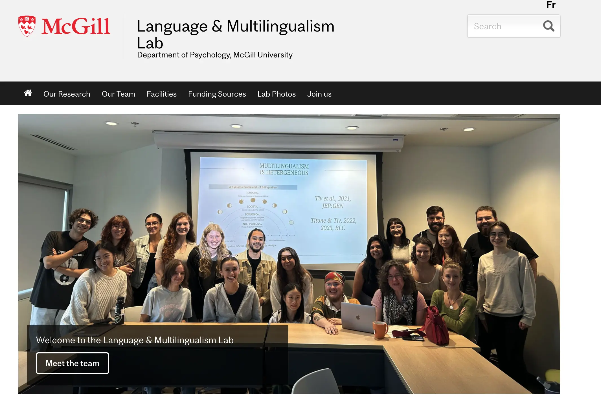

# Open Academic Analytics

We investigate faculties with research groups at UVM. We have a few questions that we want to answer

- How do they differ from their colleagues without groups, generally speaking?
  - Do they have different collaboration patterns?
  - Do they publish differently?
    - Maybe in more prestigious venues?
    - Is there something about the kind of paper that lead to the growth of groups? (e.g. theoretical versus empirical)
  - How long is the average lifespan of a research group?

<div class="tip">
    We simply define research groups _as any faculty claiming publicly on the internet to have such group, being overinclusive as a first step_. We also identify perceived sex based on pictures when googling the faculties. The faculty list we use to google is <a href=https://www.uvm.edu/sites/default/files/UVM-Office-of-Institutional-Research-and-Assessment/other-files/Final_FY24_Base_Pay.pdf/>this payroll from 2023</a>. You can find the data loader on the github.
</div>

## Count data section

Here's the raw data to play with

 <div class="card" style="padding: 0;">
    ${Inputs.table(search)}
</div>

```js
const search = view(Inputs.search(rawData, {placeholder: "Search raw data…"}));
```

Alright, so we find that **${rawData.filter(d=>d.has_research_group == 1).length} / ${rawData.length} (≈${(rawData.filter(d=>d.has_research_group == 1).length / rawData.length * 100).toPrecision(4)}%)** of faculties at UVM have a research group. Let this sink in. Did you expected a bigger number? Smaller? This number is the result of many google searches. The nice thing of labeling data is that the following is also exact

```js
Plot.plot({
    width: 300,
    height: 200,
    y: {grid: true},
    color: {range: ["pink", "lightblue"]},
    x: {scale: "ordinal", label: null}, 
    caption: "Total number of faculties with groups and grouped by perceived sex. Yes we have used pink and blue to distinguish perceived sec. We won't be sorry, it helps with interpretation.",
    marks: [
      Plot.barY(rawData, Plot.groupX({y: "count"}, {
        x: d=>+d.perceived_as_male, fill: "perceived_as_male", 
        tip:true,
        fx: "has_research_group", 
        sort: {y: "-y"}}))
    ]
  })
```
If we break by `perceived_sex`, we can that we almost have parity in faculty numbers for those without groups, but not at all for faculties with research groups.

Next, we look at the same plot by department. Here, we stack gender to ease readability, and facet by department and by whether faculties in that department have a research group.

<div>
  <div>${resize((width) => waffles(colleges[0], {width}))}</div>
  <div class="warning">
    There might be still some mistakes in the data. For example, sometimes maybe a program was misinterpreted as department. If so, feel free to correct the mistake on the <a href="https://docs.google.com/spreadsheets/d/1LYoj01Wnfhd8SPNZXg1bg1jjxE9TSZ-pCKhoqhD0uWo/edit?gid=328051137#gid=328051137">excel sheet</a>.
  </div>
  <div>${resize((width) => waffles(colleges[1], {width}))}</div>
  <div class="warning">
    I might have removed the (COM) profs from base payroll, leading to have way fewer people by department than expected. I need to fix that at some point.
  </div>
  <div>${resize((width) => waffles(colleges[2], {width}))}</div>
  <div>${resize((width) => waffles(colleges[3], {width}))}</div>
  <div>${resize((width) => waffles(colleges[4], {width}))}</div>
  <div>${resize((width) => waffles(colleges.slice(5,8), {width}))}</div>
</div>

If we assume that digital humanities tend to lead to research groups (unproven assumption), digital humanities do not seem to be happening at UVM. That is, economics, english, history, sociology, political science, sociology, philosophy do not have much research groups (with some exceptions that we could reach out). Business people don't do groups either. I guess this is not as big as a surprise.

We find groups in the following departments

- Biology, Plant Science, ... ecologists basically. The Rubenstein School of Environment have groups too.
- Also small biology, such as biochemistry, pharamaco, chemistry, etc.
- The department of psychological science have labs.
- Engineering people have groups, as do computer scientists (duh).

## Exploring groups

First, you can query the table of faculties with groups. If some particular website is of interest, you can put it in the preview cards below to see what they look like (or visite them directly). I'm highlighting a few labs i find interesting below.

```js
const groups = db2.query(`
SELECT payroll_name, perceived_as_male, group_url, dept, college FROM rawData WHERE group_url IS NOT null
`)
```

<div class="card" style="padding: 0;">
    ${Inputs.table(search2)}
</div>


```js
const search2 = view(Inputs.search(groups, {placeholder: "Search data…"}));
```

Let's visualize a few of those URLs. You can click on the card to visit the website. The Rubenstein has quite a few interesting labs

<div style="display: grid; grid-template-columns: repeat(auto-fill, minmax(300px, 1fr)); gap: 16px; width: 100%;">
    <div>
        ${card("https://ecoculturelab.net/")}
    </div>
    <div>
        ${card("https://nced.weebly.com")}
    </div>
    <div>
        ${card("https://all-geo.org/jefferson/people/")}
    </div>
</div>

Unclear if there are still students involved in the eco culture lab, but the guy who started it seems to be a hot shot. The The Watershed Lab (rightmost) is super active, might be worth reaching to them. There are quite a few labs in the psychological sciences as well. Most are behavioral experiments, but maybe they have cool data we don't know about. Since i have a BA in psychology, I can say that most often in the field they don't tend to have super strong computational skills but they might be shifting towards more observational data to supplement their experimental data.

<div style="
    display: grid;
    grid-template-columns: repeat(auto-fill, minmax(300px, 1fr));
    gap: 16px;
    width: 100%;
  ">
    <div>
      ${card("https://nervelab.w3.uvm.edu")}
    </div>
    <div>
      ${card("https://www.fernlab-uvm.com/people")}
    </div>
    <div>
      ${card("https://www.todd-lab.org/personnel")}
    </div>
</div>

Alexis Brieant's lab have super cool project, e.g. The Adolescent Brain Cognitive Development (ABCD) Study is a longitudinal studies with nearly 12,000 families across the United States. They are open sourcing as much as they can. 

<div class="tip"> 
Speaking of which, maybe we could reach to Debra Titone eventually, she was open for some collaboration when we talked to her at Netsci: <a href="https://www.mcgill.ca/language-lab/">lab website</a>
<br><br>
</img>
</div>


<!-- APPENDIX -->

```js
const db = DuckDBClient.of({
  data: FileAttachment("uvm_profs_2023.parquet"),
  dept2col: FileAttachment("uvm_dept2col.parquet")
  });
```

```js
const data = db.query(`
  WITH expanded AS (
    SELECT *, UNNEST(STR_SPLIT(host_dept, '; ')) AS dept
    FROM data
    WHERE has_research_group != '999'
  ),
  joined AS (
    SELECT e.*, d.college
    FROM expanded e
    LEFT JOIN dept2col d
    ON TRIM(e.dept) = d.department
  )
  SELECT *
  FROM joined;
`)
```

```js
const rawData = [...data]
```

```js
const db2 = DuckDBClient.of({
  rawData: rawData,
  });
```

```js
const countData = db2.query(`
WITH dept_totals AS (
    SELECT UNNEST(STR_SPLIT(host_dept, '; ')) AS host_dept, COUNT(*) AS total_n
    FROM rawData
    WHERE has_research_group IS NOT NULL AND has_research_group != 999
    GROUP BY host_dept, college
    ORDER BY total_n DESC
)
SELECT COUNT(*) AS n, d.has_research_group, d.host_dept, d.perceived_as_male, d.college
FROM rawData d
JOIN dept_totals t ON d.host_dept = t.host_dept 
WHERE d.has_research_group IS NOT NULL AND d.has_research_group != 999
GROUP BY d.has_research_group, d.host_dept, d.perceived_as_male, d.college
ORDER BY d.host_dept, d.has_research_group, d.college
`)
```


```js
function card(url) {
    return html`<a href=${url} target="_blank" style="
        display: block;
        text-decoration: none;
        border-radius: 8px;
        overflow: hidden;
        box-shadow: 0 2px 8px rgba(0,0,0,0.1);
        border: 1px solid #eee;
        height: 100%;
        ">
         <div style="
            width: 100%;
            height: 300px;
            overflow: hidden;
            position: relative;
            background: #f5f5f5;
        ">
      <iframe src=${url} style="
            position: absolute;
            top: 0;
            left: 0;
            width: 300%;
            height: 300%;
            border: none;
            transform: scale(0.33);
            transform-origin: 0 0;
            pointer-events: none;
          " ></iframe>
        </div>
      </a>`
}
```

```js
function waffles(c, {width} = {}) {
  
  return Plot.plot({
  title: c,
  axis: null,
  label: null,
  height: 260,
  width,
  marginTop: width == 1200 ? 120 : 80,
  inset: width == 1200 ? 7 : 10,
  color: {range: ["pink", "lightblue"]},
  marks: [
    Plot.frame(),
    Plot.axisFx({lineWidth: width == 1200 ? 5 : 8, anchor: "top", dy: -1}),
    Plot.axisFy({anchor: "left", label: "Has research group"}),
    Plot.waffleY(countData, {
      filter: d => c.includes(d.college),
      y: "n", rx: "100%", 
      fx: "host_dept", 
      fy: "has_research_group",
      fill: "perceived_as_male", 
      tip:true,
      sort: {y: "-y", fx: "-y", reduce: "sum"},
    })
  ]
}) 
}
```


```js
const colleges = Array.from(new Set([...rawData.map(d=>d.college)]))
```